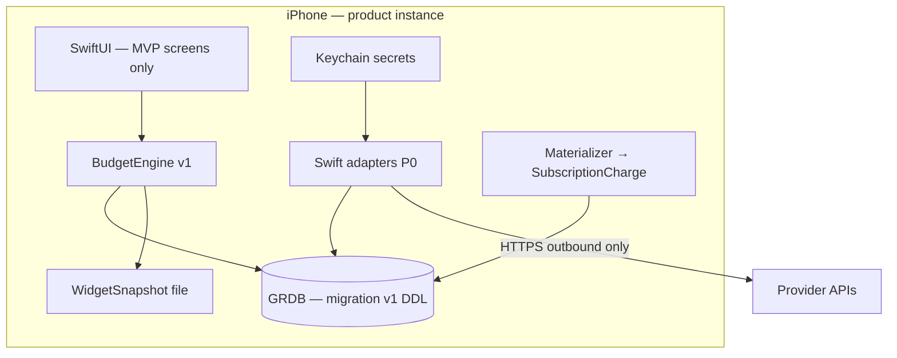

# Mobile Full Parity + Phone as Self-Hosted Runtime

| Field | Value |
|---|---|
| **Status** | Ready for implementation (dual iOS apps; local app scaffolded; MVP contracts locked) |
| **Author** | Architecture (Grok) |
| **Date** | 2026-08-04 |
| **Revised** | 2026-08-04 (owner: dual apps — remote client for live sync + separate on-device Local app) |
| **Repo** | `/Users/jay/Code/Usage-Monitor` |
| **Audience** | Senior engineers / multi-agent fleet implementing incremental PRs |
| **Related** | `ios/UsageMonitor/ARCHITECTURE-CONTRACT.md`, `ios/README.md`, `prisma/schema.prisma` |

---

## Overview

**Product model (owner decision, 2026-08-04):** **two iOS apps** in this monorepo — not one binary with a compile flag.

| App | Bundle ID | Who | Data plane |
|---|---|---|---|
| **Usage Monitor** (existing) | `services.jays.usage.monitor` | Owner + anyone who self-hosts a **server** the way the owner does | **Remote** Next.js + SQLite (Oracle / Docker / VPS). Live sync, ingest, OTLP, widgets against that host. |
| **Local Usage Monitor** (new) | `services.jays.local.usage.monitor` | Users who want the phone to **be** the instance | **On-device** GRDB + Keychain + Swift adapters. No required remote host. |

The owner keeps using **Usage Monitor** against `usage.jays.services` (or any self-hosted origin) with live sync. That same **client + server** path is what we document and share for self-hosters who want “how I run it.” **Local Usage Monitor** is a **separate App Store product** for true phone-only self-host.

Topology **A** remains the answer for the **remote client app**. Topology **D (native local data plane)** is the answer for the **Local app only** — never “run Next.js on the iPhone.”

**v1 Local bar:** shippable **poll + subscription** personal budget app — Overview, Providers, Alerts, Settings CRUD, widget, App Lock — with **honest** non-parity for live OTLP/ingest and fleet ops. See [MVP Surface Freeze](#mvp-surface-freeze-v1-app-store).



---

## Background & Motivation

### Two iOS apps (do not conflate)

| App / SKU | Runtime | Shared kit | Product path |
|---|---|---|---|
| **Usage Monitor** | Client → self-hosted or owner Next.js | `UsageMonitorKit` remote features | **Live-sync / full stack** — owner daily driver; also what we ship docs for “self-host like me” (server + this app) |
| **Local Usage Monitor** | On-device GRDB + adapters | Shared `Models` / `DesignSystem` / `AppLock` + **new** `LocalStore` / `LocalDataPlane` | **Phone-only App Store** — separate target, separate app group, separate bundle ID |
| **Server** | Oracle / Docker self-host | N/A (Node) | Shared with remote client; **not** required for Local app |

### Why Local is a separate app (not a compile flag)

1. **Different trust model:** remote client stores host tokens + session cookies; Local stores provider API keys and is the sole money-truth.  
2. **Different App Store privacy labels** and review notes.  
3. **No dual cash** risk from one binary toggling modes.  
4. Owner can keep full remote features (APNs register, intelligence, ops) without shipping them to Local.  
5. Separate app groups: `group.services.jays.usage.monitor` vs `group.services.jays.local.usage.monitor`.

**K16 revised:** App Store **Local** binary has no remote money path. The **remote client app** remains fully remote (no `LOCAL_DATAPLANE` flag required).

### Platform limits (unchanged, still binding)

1. BGAppRefresh opportunistic — in-repo `BackgroundRefreshManager` earliest interval default **2 hours**; no 15‑min SLA.  
2. No durable inbound ports — no live CT/ST/OTLP to a sleeping phone.  
3. `src/lib/adapters/helpers.ts` uses `node:dns/promises`, `node:https`, `node:net`, `AsyncLocalStorage` — **not** portable; WASM-TS adapters **rejected for v1**.  
4. Server `budget-status.ts` ~2.4k LOC — phone ports a **specified subset**, not a line-by-line clone.

---

## MVP Surface Freeze (v1 App Store)

**Goal language:** ship **Milestone A** surface below. Do **not** interpret “parity” as “every Oracle web screen.”

### In scope (Milestone A — TestFlight / App Store MVP)

| Surface | Behavior |
|---|---|
| **Overview** | MTD summary + provider tiles from **BudgetEngine v1** |
| **Providers** | List, detail, local snapshot history chart, Fetch now, active toggle, budget edit |
| **Alerts** | In-app feed from local rules + **local** notifications (`PushScaffold` / `AlertNotifier`) |
| **Projects** | List/detail + CRUD; **direct** spend only (no residual % allocation in v1) |
| **Settings** | Provider CRUD (P0 types + subscription-primary stubs), subscription CRUD, App Lock, appearance, **Export/Import**, Wipe data |
| **Widget** | Existing `WidgetSnapshot` file path written by BudgetEngine (not live GRDB in extension) |
| **Money rules** | Poll snapshots + `SubscriptionCharge` rows + optional plan fixed fee (exclusivity) |

### Explicitly out of MVP (do not build in Milestone A)

| Out | Reason |
|---|---|
| Intelligence (LLM burn, Claude cost check, key attribution) | Needs OTLP/push events |
| Ops / Sentry / receipt inbox | Fleet |
| Remote Slack/PD/email/APNs channels | Fleet; local notifs only |
| External-billing auto-adoption / corrections | Server subtlety |
| Live CT/ST ingest / OTLP listener | Impossible on phone |
| Residual project % allocations | Defer v1.1 |
| Full ~40 adapter port | Milestone B series after MVP |
| Remote companion mode in App Store binary | **K16:** compile-out; owner fleet scheme separate |

**Money bar:** parity of **outcomes** for a **poll + subscription** world under BudgetEngine v1 — not parity with full Oracle `max(poll,push)` + receipt floors + adoption proofs.

---

## Goals & Non-Goals

### Goals

1. On-device personal instance (GRDB + Keychain).  
2. **MVP surface freeze** above — shippable App Store product.  
3. Poll-primary costs for **locked P0 adapters** + subscription-primary modeling for blinds (e.g. personal Claude).  
4. Local materializer → `SubscriptionCharge` + BudgetEngine v1.  
5. Opportunistic BG + manual refresh (document no cadence SLA).  
6. Public App Store + privacy matrix.  
7. Export package v1 + replace/merge import for migration.  
8. Incremental PRs that **do not break** Oracle production.

### Non-Goals

1. Node/Next/WASM-TS on iOS.  
2. Inbound HTTPS server for fleet producers.  
3. Guaranteed 15‑minute multi-provider polls.  
4. Multi-tenant SaaS.  
5. Topology A as product.  
6. Dual money-truth without explicit import mode.  
7. Android v1.  
8. “Full UI parity with Oracle web” as an unbounded backlog.

---

## Feasibility: Phone as Self-Hosted Runtime

| Interpretation | Verdict |
|---|---|
| Native Swift data plane + GRDB | ✅ **Product architecture** |
| Thin remote client only | ❌ Not self-host on phone |
| Embed Node/Next | ❌ |
| Inbound OTLP 24/7 | ❌ |
| WASM of TS adapters | ❌ v1 (`helpers.ts` Node imports) |
| Always-on relay for producers | ❌ pure product non-goal |

**User-facing store sentence (locked):**  
> “Usage Monitor on iPhone tracks **API costs for providers you configure with keys** and **subscriptions you enter**, with budgets and alerts **stored on your device**. It does **not** receive live agent telemetry from other machines while the phone is asleep.”

---

## Topology

**Selected: D — on-device native data plane.**  
**Rejected for product: A, C, E-as-product, F (Node embed).**

Oracle fleet SKU is orthogonal (export may feed phone).

---

## Proposed Design

### 1. Principles

1. Phone GRDB is product money-truth.  
2. One active money writer per dataset (import is explicit).  
3. Outbound-only networking for product core.  
4. Keep UsageMonitorKit UI layering; inject **LocalDataPlane** under `BudgetStore`.  
5. **PR-2 cannot invent columns** not listed in §2.2.1.  
6. Widget stays file-snapshot based in v1.  
7. **App Store binary = local-only** (`LOCAL_DATAPLANE`); remote client only in owner/debug scheme (K16).

### 2. On-device storage

#### 2.1 Technology

| Choice | Lock |
|---|---|
| Engine | **GRDB** (SQLite), SPM target `LocalStore` |
| DB path | Application Support (app process). **Not** required in App Group for v1 |
| Widget | BudgetEngine writes **`WidgetSnapshot`** via existing `SharedStore` / App Group **file** (same as today) — **no GRDB in widget extension v1** |
| Secrets | Keychain only; SQLite holds `keychainAccountId` reference |
| Migrations | Numbered GRDB `DatabaseMigrator` versions; v1 = this section only |
| Backup | User export package (Files / share sheet); DB files excluded from naïve backup where secrets adjacent |

#### 2.2 Schema subset (conceptual)

Tables in migration v1: `app_meta`, `provider`, `provider_plan`, `usage_snapshot`, `subscription`, `subscription_charge`, `project`.  
**Omit:** external billing, APNs tokens, alert channel delivery claims, tombstones, key identity graphs, receipt paths, rollups (optional later).

#### 2.2.1 Migration v1 DDL (authority — PR-2 must not invent columns)

SQLite types. UUIDs as `TEXT`. Money as `REAL`. Timestamps as `TEXT` ISO-8601 UTC or `REAL` julian — **lock: TEXT ISO-8601 UTC** for portability with export JSON.

```sql
-- migration_v1

CREATE TABLE app_meta (
  key   TEXT PRIMARY KEY NOT NULL,
  value TEXT NOT NULL
);
-- required keys: schema_version='1', installed_at, last_maintenance_at (nullable)

CREATE TABLE provider (
  id                   TEXT PRIMARY KEY NOT NULL,
  name                 TEXT NOT NULL,
  display_name         TEXT NOT NULL,
  type                 TEXT NOT NULL DEFAULT 'builtin',  -- builtin | custom
  adapter_kind         TEXT NOT NULL,  -- e.g. openrouter, openai, anthropic_admin, subscription_only
  category             TEXT,
  is_active            INTEGER NOT NULL DEFAULT 1,
  refresh_interval_min INTEGER NOT NULL DEFAULT 60,
  label                TEXT,
  keychain_account_id  TEXT,  -- null if subscription_only / no key
  non_secret_config_json TEXT, -- JSON object; never secrets
  last_fetch_at        TEXT,
  last_fetch_error     TEXT,
  created_at           TEXT NOT NULL,
  updated_at           TEXT NOT NULL
);
CREATE UNIQUE INDEX idx_provider_name ON provider(name);

CREATE TABLE provider_plan (
  provider_id            TEXT PRIMARY KEY NOT NULL REFERENCES provider(id) ON DELETE CASCADE,
  billing_mode           TEXT NOT NULL DEFAULT 'manual',
  fixed_monthly_cost_usd REAL,
  monthly_budget_usd     REAL,
  monthly_request_limit  INTEGER,
  renewal_date           TEXT,
  billing_interval       TEXT DEFAULT 'monthly',
  notes                  TEXT,
  updated_at             TEXT NOT NULL
);

CREATE TABLE usage_snapshot (
  id                    TEXT PRIMARY KEY NOT NULL,
  provider_id           TEXT NOT NULL REFERENCES provider(id) ON DELETE CASCADE,
  fetched_at            TEXT NOT NULL,
  balance               REAL,
  total_cost            REAL,
  fixed_cost_included_usd REAL,
  cost_window_start     TEXT,
  cost_window_end       TEXT,
  cost_scope            TEXT,  -- calendar_month_to_date | billing_cycle_to_date | daily | unknown
  cost_includes_unknown_fixed INTEGER NOT NULL DEFAULT 0,
  total_requests        INTEGER,
  credits               REAL,
  cost_coverage_caveat_code TEXT,
  cost_coverage_caveat_message TEXT,
  -- raw_data intentionally OMITTED in v1 (size + privacy); optional debug later
  created_at            TEXT NOT NULL
);
CREATE INDEX idx_snapshot_provider_fetched ON usage_snapshot(provider_id, fetched_at);
CREATE INDEX idx_snapshot_fetched ON usage_snapshot(fetched_at);

CREATE TABLE subscription (
  id                        TEXT PRIMARY KEY NOT NULL,
  provider_id               TEXT NOT NULL REFERENCES provider(id) ON DELETE CASCADE,
  project_id                TEXT REFERENCES project(id) ON DELETE SET NULL,
  name                      TEXT NOT NULL,
  description               TEXT,
  cost_usd                  REAL NOT NULL,
  currency                  TEXT NOT NULL DEFAULT 'USD',
  interval                  TEXT NOT NULL DEFAULT 'monthly', -- weekly|monthly|quarterly|annual
  interval_count            INTEGER NOT NULL DEFAULT 1,
  anchor_day                INTEGER,
  start_date                TEXT NOT NULL,
  current_period_start      TEXT NOT NULL,
  next_renewal_at           TEXT NOT NULL,
  last_charged_period_start TEXT,  -- materializer watermark
  auto_renew                INTEGER NOT NULL DEFAULT 1,
  status                    TEXT NOT NULL DEFAULT 'active', -- active|paused|canceled|considering
  canceled_at               TEXT,
  notes                     TEXT,
  created_at                TEXT NOT NULL,
  updated_at                TEXT NOT NULL
);
CREATE INDEX idx_subscription_provider ON subscription(provider_id);
CREATE INDEX idx_subscription_status_renewal ON subscription(status, next_renewal_at);
-- v1: no external_billing_* columns (adoption deferred)

CREATE TABLE subscription_charge (
  id               TEXT PRIMARY KEY NOT NULL,
  subscription_id  TEXT NOT NULL REFERENCES subscription(id) ON DELETE CASCADE,
  provider_id      TEXT NOT NULL REFERENCES provider(id) ON DELETE CASCADE,
  project_id       TEXT REFERENCES project(id) ON DELETE SET NULL,
  period_start     TEXT NOT NULL,
  period_end       TEXT NOT NULL,
  cost_usd         REAL NOT NULL,
  currency         TEXT NOT NULL DEFAULT 'USD',
  materialized_at  TEXT NOT NULL,
  UNIQUE (subscription_id, period_start)
);
CREATE INDEX idx_charge_provider_period ON subscription_charge(provider_id, period_start);

CREATE TABLE project (
  id                 TEXT PRIMARY KEY NOT NULL,
  name               TEXT NOT NULL,
  name_key           TEXT NOT NULL, -- lowercased trimmed unique
  description        TEXT,
  monthly_budget_usd REAL,
  created_at         TEXT NOT NULL,
  updated_at         TEXT NOT NULL
);
CREATE UNIQUE INDEX idx_project_name_key ON project(name_key);

-- v1: NO provider_project_allocation table (residual % deferred)
```

**PR-2 acceptance:** migrator applies exactly these tables/indexes; unit tests open DB and insert fixture rows; **no** extra money tables without a design amendment.

#### 2.3 Money rules — BudgetEngine v1 (locked)

##### 2.3.1 UTC month

`monthStart` = first instant of current UTC calendar month; `now` = current UTC. Match server convention (Agents.md / budget-status).

##### 2.3.2 Per-provider `spentUsd` (v1)

**Snapshot eligibility (locked — no `grace` symbol):** pick **one** `latestEligibleSnapshot` for provider `P` as the first matching rule, using the latest row by `fetched_at` within that rule:

1. **Prefer calendar MTD:** latest snapshot where  
   `total_cost IS NOT NULL`  
   AND `cost_scope = 'calendar_month_to_date'`  
   AND (`cost_window_start IS NULL` OR `cost_window_start >= monthStart`).
2. **Else unknown-scope current-month fetch:** latest snapshot where  
   `total_cost IS NOT NULL`  
   AND `cost_scope = 'unknown'`  
   AND `fetched_at >= monthStart`.
3. **Else:** none → `pollVariableUsd = 0`.

**v1 does not** treat `billing_cycle_to_date` or `daily` as budget-facing (no conversion). Those scopes never win eligibility even if `total_cost` is set.

```
pollVariableUsd =
  max(0, latestEligibleSnapshot.total_cost
         - coalesce(latestEligibleSnapshot.fixed_cost_included_usd, 0))
  // if no eligible snapshot → 0

importVariableUsd = 0  // v1 pure: no ExternalUsageEvent table
// if Milestone B+ imports events: max(pollVariableUsd, sum(import variable costs in month))

subscriptionChargesUsd =
  sum(subscription_charge.cost_usd) where provider_id = P and period_start >= monthStart and period_start < nextMonth

planFixedUsd =
  provider_plan.fixed_monthly_cost_usd if non-null and > 0
  AND there is NO subscription on this provider with status IN ('active','considering')
  // exclusivity: active/considering Subscription models the fee — do not double-count plan fixed

spentUsd = pollVariableUsd + subscriptionChargesUsd + planFixedUsd
```

**Exclusivity enforcement (writes):** creating/updating a subscription to `active`/`considering` with `cost_usd > 0` while `provider_plan.fixed_monthly_cost_usd > 0` → **reject** (mirror server 400). Clearing plan fixed or pausing subscription restores the other path.

##### 2.3.3 Explicitly **not** ported in BudgetEngine v1

| Server behavior | Phone v1 |
|---|---|
| `max(snapshotVariable, pushVariable)` with live push | No live push; import path later |
| Receipt-backed floors | Omit |
| External-billing adoption / charge corrections | Omit |
| Multi-provider alias / canonical key identity | One local provider row = one identity |
| Anomaly MAD alerts | Optional later; v1 alerts = budget thresholds + stale snapshot only |
| Project residual % allocations | **Direct only:** sum `subscription_charge` with `project_id` + optional future tagged snapshots (none in v1 polls) |
| `reconcileFixedCosts` full matrix | Simplified exclusivity above |

##### 2.3.4 Projection / alerts (minimal)

- `projectedEomUsd`: linear on elapsed UTC month fraction for **variable** portion only:  
  `pollVariableUsd / max(elapsedFraction, 0.02) * remainingFraction + subscriptionChargesUsd + planFixedUsd`  
  (withhold wild projection if elapsedFraction &lt; 0.02 — same spirit as llm-burn docs).  
- Budget levels: unconfigured / ok / warning (≥80%) / exceeded — match existing `BudgetLevel` in iOS Models.  
- Stale alert: `now - last_fetch_at` &gt; 2 × `refresh_interval_min` (or 24h default) for active pollable providers.

##### 2.3.5 Golden vectors

PR-5 must ship Swift tests (and optional shared JSON vectors) covering:

1. UTC month boundary: snapshot with `cost_window_start < monthStart` ignored; `unknown` scope with `fetched_at < monthStart` ignored.  
2. Prefer `calendar_month_to_date` over older `unknown` when both exist.  
3. `billing_cycle_to_date` / `daily` never contribute even if `total_cost` set.  
4. `fixed_cost_included_usd` subtracted from poll variable.  
5. Subscription charge in month counted once.  
6. Plan fixed suppressed when active subscription exists.  
7. No double-count plan fixed + subscription.  

Port period planning tests from `planSubscriptionCharges` / `subscriptions.ts` in PR-7.

### 3. Adapters

#### 3.1 `LocalUsageResult` v1 (subset — not field-for-field `UsageResult`)

Server `UsageResult` (`helpers.ts`) includes `rawData`, `externalBilling*`, `postPersistError`, etc. Phone **must not** reimplement external-billing adoption.

```swift
public struct LocalUsageResult: Sendable, Equatable {
    public var totalCost: Double?
    public var balance: Double?
    public var fixedCostIncludedUsd: Double?
    public var costWindowStart: Date?
    public var costWindowEnd: Date?
    public var costScope: CostScope  // calendarMonthToDate | billingCycleToDate | daily | unknown
    public var costIncludesUnknownFixed: Bool
    public var totalRequests: Int?
    public var credits: Double?
    public var costCoverageCaveat: CostCoverageCaveat?  // code + message
    public var fetchedAt: Date
}

public enum AdapterRunError: Error {
    case configuration(String)
    case httpStatus(Int)
    case invalidResponse(String)
    case timeout
    case transport(String)
    case unsupported(String)  // blind / not pollable on this build
}
```

| Server field | v1 phone |
|---|---|
| `totalCost`, windows, scope, requests, credits, balance, fixedCostIncluded, caveat | **Keep** |
| `rawData` | **Drop** persistence |
| `externalBilling` / `externalBillingSyncs` | **Drop** (do not parse into adoption) |
| `postPersistError` | Map to fetch error state on provider row |

**Run contract:**

- Timeout: **30s** per adapter (align `ADAPTER_HTTP_TIMEOUT_MS` spirit).  
- Single-flight actor per process (UI refresh vs BG).  
- **Success:** insert `usage_snapshot` + clear `last_fetch_error`.  
- **Failure:** no snapshot row (or optional failed marker only via `last_fetch_error` / `last_fetch_at`); do not invent zero-cost success.  
- Blind/unsupported: `adapter_kind = subscription_only` never calls network.

#### 3.2 P0 pollable adapters (locked order)

| Order | `adapter_kind` | Why | Notes |
|---|---|---|---|
| **1** | `openrouter` | Server has real MTD path **only for Management keys** | First PR-4; see **§3.2.1** key-tier policy |
| **2** | `openai` | Real cost/usage poll (`openai.ts`) | Second; complex but proven |
| **3** | `deepseek` | Simple balance endpoint | Thin third adapter for Milestone B or late A if time |
| **—** | `anthropic_admin` | **Optional** org Admin key only | Individual Claude = **not** pollable |

**Do not** put in P0 poll ports:

| Provider | Code reality | Phone modeling |
|---|---|---|
| **Anthropic individual** | `blindProviderResult` without Admin key (`anthropic.ts`) | `adapter_kind=subscription_only` + **Subscription** (Claude plan) |
| **Tiingo** | `blindProviderResult` | subscription_only / manual |
| **FMP** | `blindProviderResult` | subscription_only / manual |
| **Voyage** | push/manual, no key poll | subscription_only |

PR-4 **must** start with **OpenRouter** under §3.2.1. Anthropic personal is a **Settings subscription template**, not adapter sprint zero.

#### 3.2.1 OpenRouter key-tier policy (locked — matches `openrouter.ts`)

Verified server behavior (`src/lib/adapters/openrouter.ts`):

| Key tier | `totalCost` | Notes |
|---|---|---|
| **Standard inference key** | Always **`null`**, `costScope: "unknown"` | Success is reduced-capability; monthly usage may appear only as diagnostic `keyInfo.usage_monthly` / rawData — **not** budget-facing on server |
| **Management / Provisioning key** (`is_management_key` or `is_provisioning_key`) | May be set from `/activity` MTD when `UTC day ≤ 30` | `costScope: "calendar_month_to_date"` + caveat `openrouter_activity_mtd_estimate`; day 31 of 31-day months: `totalCost` withheld |

**Phone v1 policy (do not diverge):**

1. **Budget MTD requires an OpenRouter Management (Provisioning) API key.** UI copy, add-provider help, and App Review notes must say so.  
2. **Inference-only key:** still a successful poll (connection health, optional limit diagnostics) but **`LocalUsageResult.totalCost = null`**, `costScope = .unknown` — BudgetEngine → `pollVariableUsd = 0`. Show empty-state: “Connected — month-to-date cost needs a Management key” + offer **Subscription** for manual tracking.  
3. **Do not** map `usage_monthly` → `totalCost` on the phone (would diverge from server cash semantics and mislead users).  
4. **Fixtures for PR-4/PR-5:** management-key recorded responses with non-null `calendar_month_to_date` `totalCost` for demo budgets; separate fixture for inference-only → null cost UI.  
5. Management-key path should mirror server caveats (activity estimate, day-31 withhold) when porting.

**Demo path:** Review notes = “add OpenRouter **Management** key (or load management fixture)” — never “any OpenRouter key shows spend.”

#### 3.3 Protocol

```swift
public protocol ProviderAdapter: Sendable {
    var adapterKind: String { get }
    func fetchUsage(credentials: ProviderCredentials) async throws -> LocalUsageResult
}
```

### 4. Scheduler / maintenance

| Trigger | Work |
|---|---|
| Pull-to-refresh / Fetch now | Selected or all **due** pollable providers |
| BGAppRefresh | Time-budgeted due polls + materializer + alert eval; **no remote bearer required** in local mode |
| Launch | Materializer + BudgetEngine refresh |

Due = `last_fetch_at` older than `refresh_interval_min` (minimum gap, not SLA).

### 5. BudgetStore integration

- `BudgetStore` loads from `BudgetEngine.compute() -> BudgetStatusResponse`-compatible DTO (existing `Models`).  
- Local mode: never call remote money write APIs (CI/test gate).  
- Remote scheme (owner only): existing `APIClient` — not in App Store binary (K16).

### 6. Subscriptions

- CRUD local.  
- Materializer ports pure `planSubscriptionCharges` planning; writes **`subscription_charge`** only (K17).  
- Only `status = active` generates charges.  
- Watermark: `subscription.last_charged_period_start`.

### 7. Telemetry cut (product messaging)

- **No live** CT/ST/OTLP in v1 (K15).  
- File import of OTLP dumps: **after Milestone A** only.  
- Store listing uses locked sentence in Feasibility.

### 8. UI / dual SKU (K16)

| Binary / scheme | Mode |
|---|---|
| **App Store / Release Local** | `LOCAL_DATAPLANE` only — no host URL, no remote money client |
| **Owner Fleet Debug** | Optional remote read companion scheme (not App Store) |

Do **not** ship a soft Advanced remote mode in the public binary before/during MVP — avoids dual-cash footguns and topology-A product creep.

### 9. Auth

Single user; Face ID `AppLock`; Keychain provider secrets; Wipe data clears GRDB + Keychain entries for this app.

### 10. App Store privacy matrix (v1)

| Topic | Answer for questionnaire / policy |
|---|---|
| **Data collection (developer)** | **No** analytics, ads, or account system in v1. Processing is **on-device**. |
| **Data linked to identity** | **No** (no app account). |
| **API keys** | User-supplied secrets stored in Keychain; leave device **only** via HTTPS to **user-chosen** provider endpoints. Classify as **Sensitive Info** / credentials in privacy nutrition if required — disclose “Contact Info” only if support email form exists (v1: none). |
| **Usage / cost amounts** | **Financial Info** processed on-device; not transmitted to developer. |
| **Third parties** | Categories: “Cloud computing / AI API providers,” “Developer tools,” etc., **as selected by the user** when adding a provider. Dynamic domain list maintained in privacy policy (OpenRouter, OpenAI, DeepSeek, …). |
| **Tracking** | No. |
| **NSPrivacyAccessedAPITypes** | Declare only APIs actually used (e.g. UserDefaults, file timestamps) per Apple required-reason API rules; audit at PR-12. |
| **Background fetch purpose** | “Refreshes configured provider usage and budget alerts so widgets and notifications stay current.” |
| **Account deletion** | Settings → Wipe all local data (DB + Keychain). |
| **Data export** | Settings → Export package (user control). |
| **Privacy policy URL** | Required static page: on-device processing, no sale of data, third-party key disclosure, wipe instructions. |
| **Review notes** | Demo: add OpenRouter **Management (Provisioning)** key (or management-key fixture) so MTD cost is non-null; inference-only key shows connected/no-MTD empty state; no server login. |

### 11. Export package v1

#### 11.1 Format

- File: `usage-monitor-export-v1.zip` (or single `.umexport`) containing:
  - `manifest.json`
  - `payload.json` (or `payload.json.enc` if passphrase set)
- Encryption (optional but recommended): AES-GCM via CryptoKit; passphrase → key via standard KDF (e.g. scrypt/PBKDF2 — lock in PR-9 impl notes). Unencrypted export allowed with loud UI warning.

**`manifest.json`:**

```json
{
  "format": "usage-monitor-export",
  "version": 1,
  "exportedAt": "2026-08-04T12:00:00.000Z",
  "appBuild": "…",
  "encrypted": false,
  "counts": { "providers": 0, "snapshots": 0, "subscriptions": 0, "charges": 0, "projects": 0 }
}
```

**`payload.json` sections (no secrets):**

| Section | Contents |
|---|---|
| `providers` | All provider columns except Keychain material; `keychain_account_id` **omitted**; `hasKey: bool` only |
| `providerPlans` | Plan rows |
| `usageSnapshots` | Snapshots (cap: last **90 days** or **50k** rows, whichever smaller — export flag `truncated`) |
| `subscriptions` | Full local subscription fields + watermarks |
| `subscriptionCharges` | Charges (same window cap as snapshots) |
| `projects` | Projects |
| `appMeta` | Non-sensitive keys |

**Never** include raw API keys, `secretConfig`, or fleet ingest tokens.

#### 11.2 Import modes

| Mode | Behavior |
|---|---|
| **Replace all** | Wipe local money tables (not Keychain unless user checks “also clear keys”); insert payload; user re-enters keys for `hasKey` providers |
| **Merge providers by name** | For each payload provider: if no local `name` match → insert; if match → show conflict UI: Keep local | Take import (overwrite plan/snapshots for that provider) |

**Forbidden:** import while any remote companion scheme is active (N/A on App Store binary).  
**Materializer after import:** run once; do not re-emit charges for `period_start` already present (UNIQUE constraint).

#### 11.3 Oracle → phone (PR-10)

Server export produces **same package shape**; redacts keys; maps server providers → `adapter_kind` best-effort (`openrouter`/`openai`/else `subscription_only`). User re-supplies keys on phone.

### 12. Migration phases

M0 fleet unchanged → M1 LocalStore → M2 OpenRouter poll → M3 BudgetEngine → M4 subscriptions → M5 export/import → M6 App Store local default → optional M7 more adapters.

Oracle decommission only when owner checklist met (P0 adapters + subscriptions migrated + export tested + accept loss of live push).

---

## Capability Matrix (ownership)

| Capability | Phone MVP | Fleet |
|---|---|---|
| MTD budgets (poll+subscription) | ✅ BudgetEngine v1 | ✅ full |
| Provider poll P0 | ✅ OpenRouter→OpenAI | ✅ all |
| Anthropic personal cost | ✅ Subscription row | ✅ push/OTLP/sub |
| Live OTLP / CT/ST | ❌ | ✅ |
| Widget / App Lock | ✅ | N/A |
| Remote alert channels | ❌ | ✅ |
| Ops / receipts | ❌ | ✅ |
| App Store install | ✅ | N/A |

---

## Alternatives

| Alt | Verdict |
|---|---|
| Topology A as product | Rejected (owner) |
| Node/WASM on phone | Rejected v1 |
| Shared Rust core | Phase after ≥3 Swift adapters |
| Live relay for OTLP | Non-goal pure product |
| Unbounded full adapter parity | Rejected as MVP definition |

---

## Security & Privacy

See §10 matrix. Additional: single-flight writes; import size cap (e.g. 25 MB zip); no logs of keys; Wipe is fail-closed.

---

## Observability

User-visible last fetch / errors / staleness. Optional local debug export. No developer analytics v1.

---

## Rollout & milestones

| Milestone | Definition of done | PRs |
|---|---|---|
| **A — TestFlight local MVP** | LocalStore DDL, OpenRouter poll, BudgetEngine v1, local alerts+widget file, subscriptions+charges, export **Replace all**, wipe, Face ID | PR-1…PR-7, PR-9 (replace-only OK), PR-4 OpenRouter only |
| **B — Expand adapters** | OpenAI + DeepSeek + subscription templates (Claude); import Merge | PR-8 batch, PR-9 merge, PR-10 Oracle export |
| **C — App Store** | Local-only Release, privacy matrix live, listing | PR-11, PR-12 |

**Adapter series is not unbounded MVP work** — it is Milestone B+.

---

## Risks

| Risk | Mitigation |
|---|---|
| Over-building “full web” | MVP freeze + milestones |
| Wrong P0 (blind providers) | Locked OpenRouter first |
| Inference OpenRouter key → $0 budget | K21 Management-key policy + empty-state UX |
| Cash math drift | BudgetEngine v1 formula + golden vectors |
| Dual cash | K16 local-only App Store binary |
| Widget GRDB locks | File snapshot only v1 |
| User expects Claude auto cost | Subscription-primary UX copy |
| App Review privacy | Matrix §10 |

---

## Open Questions (narrowed)

1. ~~**Passphrase required on export?**~~ **Owner (2026-08-04): optional with warning.**  
2. **OpenAI before DeepSeek in Milestone B order?** Default OpenAI second (already in P0 table).  
3. ~~**Paid App Store vs free?**~~ **Owner (2026-08-04): free.**  
4. **Import merge UI complexity in A vs B?** Default Replace-only in A; Merge in B.  
5. ~~Start Milestone A now?~~ **Owner (2026-08-04): yes — implement PR-1+.**

**Closed by design / owner:** live CT/ST/OTLP v1 = **no**; P0 poll start = **OpenRouter**; absolute phone-only product binary = **yes** (K16); App Store = **free**; export passphrase = **optional with warning**; start implementation = **yes**.

---

## Key Decisions

| # | Decision |
|---|---|
| K1 | Product = on-device native data plane |
| K2 | Topology A rejected as product answer |
| K3 | No Node/Next/WASM-TS on iOS v1 |
| K4 | GRDB + Keychain; widget = file snapshot v1 |
| K5 | Swift adapters; opportunistic BG |
| K6 | No inbound OTLP/ingest |
| K7 | BudgetEngine v1 formula locked (§2.3) |
| K8 | Local notifications only for product alerts |
| K9 | Public App Store |
| K10 | Face ID replaces dashboard password |
| K11 | Export package v1 + explicit import modes |
| K12 | Oracle fleet may continue |
| K13 | Keep UI kit; inject LocalDataPlane |
| K14 | Remote APNs/Docker product PRs de-scoped |
| K15 | v1 poll+subscription; no live push telemetry |
| **K16** | **Two apps:** `UsageMonitor` = remote live-sync client; `LocalUsageMonitor` = on-device product. No single-binary mode switch. |
| **K17** | Materializer writes **`subscription_charge`** table (not dual options) |
| **K18** | MVP surface freeze; milestones A/B/C |
| **K19** | P0 poll order: OpenRouter → OpenAI → (DeepSeek); Anthropic personal = subscription_only |
| **K20** | `LocalUsageResult` is a **bounded subset**; no externalBilling/rawData persistence |
| **K21** | OpenRouter budget MTD requires **Management key** (server-aligned); inference-only → connected, `$0` poll; no `usage_monthly`→`totalCost` mapping |
| **K23** | App Store listing is **free**; export passphrase is **optional with warning** |
| **K22** | Snapshot eligibility: prefer `calendar_month_to_date` + window; else `unknown` + `fetched_at >= monthStart`; no `grace`; no billing-cycle/daily in v1 |

---

## PR Plan

### PR-1 — Design + dual-app scaffold
- Docs + ARCHITECTURE-CONTRACT dual-app addendum  
- XcodeGen target **LocalUsageMonitor** + `LocalStore` / `LocalDataPlane` kit stubs  
- `ios/README.md` product map (remote client vs Local vs server self-host)  
- **Deps:** none  

### PR-2 — LocalStore migration v1
- **Exactly** §2.2.1 DDL; tests  
- **Deps:** PR-1  
- **Gate:** no invented columns  

### PR-3 — Keychain + provider/subscription CRUD UI (no poll)
- Includes `subscription_only` providers; Claude template copy  
- **Deps:** PR-2  

### PR-4 — ProviderAdapter + **OpenRouter** only
- LocalUsageResult; fetch now; fixtures  
- **Deps:** PR-3  
- **Forbidden:** Tiingo/FMP/blind adapters; mapping `usage_monthly` → budget `totalCost`  
- **Acceptance:** Management key fixture → non-null MTD snapshot; inference-only fixture → success + `totalCost` null + empty-state UI; help text requires Management key for budgets (§3.2.1)

### PR-5 — BudgetEngine v1 + BudgetStore local + WidgetSnapshot write
- Golden vectors §2.3.5; interim OK without charges until PR-7 (document banner “subscriptions not yet applied” until PR-7 merges)  
- **Deps:** PR-4  

### PR-6 — BGAppRefresh local mode
- No bearer gate; last success age in UI  
- **Deps:** PR-5  

### PR-7 — Materializer → `subscription_charge` + period math tests
- **Deps:** PR-5 (ideally after); updates BudgetEngine to include charges  
- **Milestone A complete** when PR-7 + OpenRouter + export replace land  

### PR-8 — Milestone B adapters
- OpenAI, then DeepSeek; optional anthropic_admin  
- **Not** required for Milestone A ship  

### PR-9 — Export package v1
- A: Replace all; B: Merge by name  
- **Deps:** PR-2+  

### PR-10 — Oracle export → same package
- Redact keys  
- **Deps:** PR-9  

### PR-11 — Release scheme LOCAL_DATAPLANE only  
### PR-12 — App Store privacy matrix, listing, review notes  

### CI gate (from PR-5)
- Unit test: LocalDataPlane build never links remote money **write** paths; no `APIClient` mutation methods in LOCAL_DATAPLANE.

### Dropped from prior remote product plan
Server APNs, Docker self-host as product, remote `view=money`, topology A QR setup, remote subscription REST create.

---

## References

- `prisma/schema.prisma` — conceptual source for column names  
- `src/lib/adapters/helpers.ts` — UsageResult (subset only on phone)  
- `src/lib/adapters/anthropic.ts` — blind without Admin key  
- `src/lib/adapters/tiingo.ts`, `fmp.ts` — blind  
- `src/lib/adapters/openrouter.ts`, `openai.ts` — real poll targets  
- `src/lib/budget-status.ts` — full server math (do not clone wholesale)  
- `src/lib/subscriptions.ts`, `subscription-materializer.ts` — pure planning  
- `ios/.../OfflineCache/BackgroundRefreshManager.swift` — 2h earliest BG  
- `ios/.../WidgetShared/SharedStore.swift` — file widget snapshot  

---

## Summary for implementers

Ship **Milestone A**: GRDB v1 DDL → OpenRouter → BudgetEngine v1 → subscriptions/charges → local alerts/widget file → export replace → App Store local-only.

**Do not** start with Anthropic personal poll, Tiingo/FMP, full web parity, or GRDB-in-widget.

**Money:** locked formula in §2.3; **charges** in `subscription_charge`; **no** dual invent-your-own schema.
